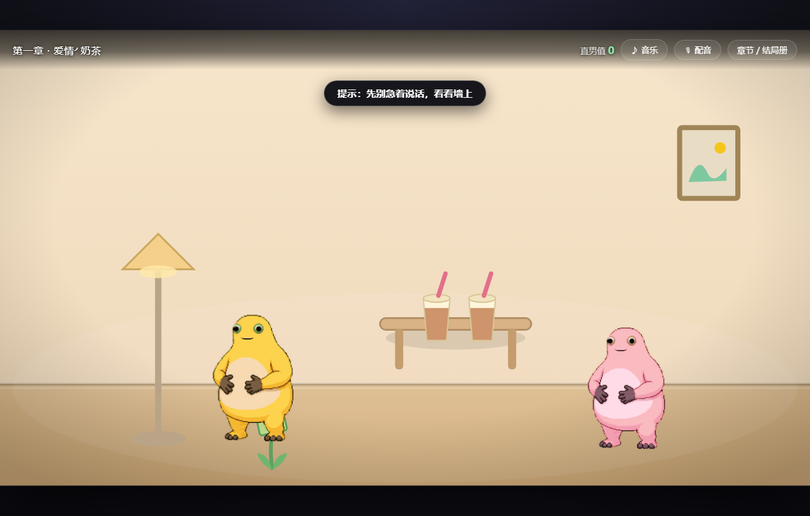
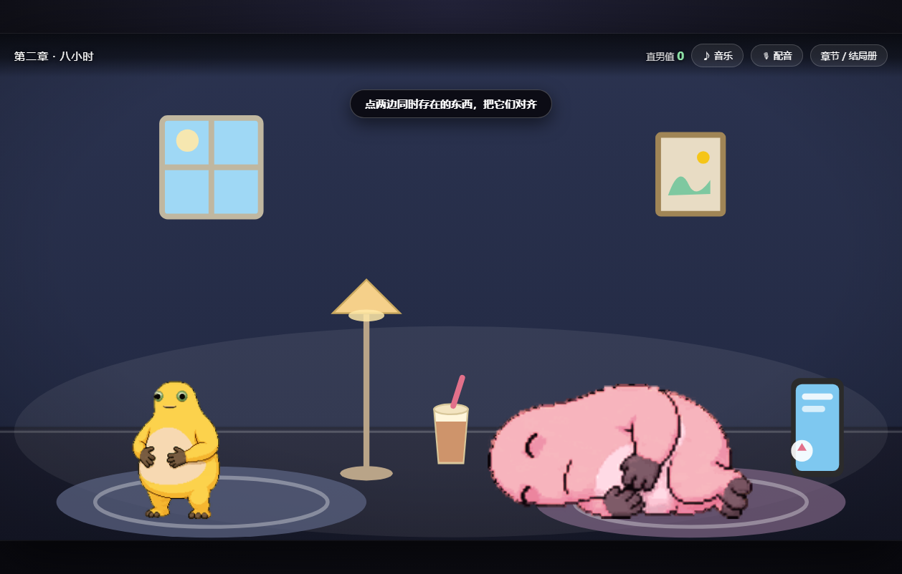
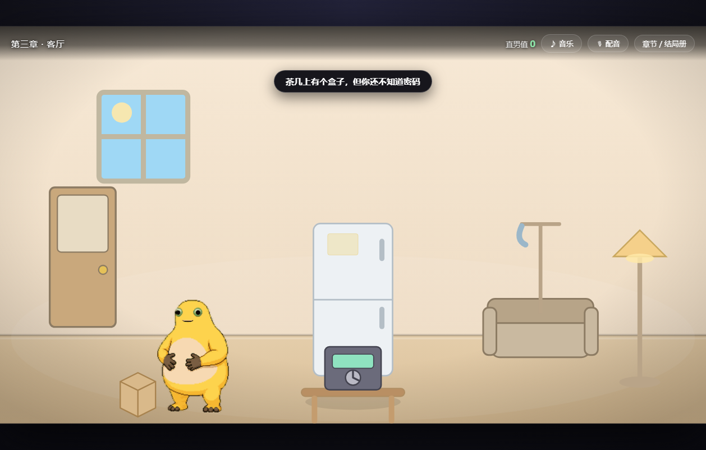
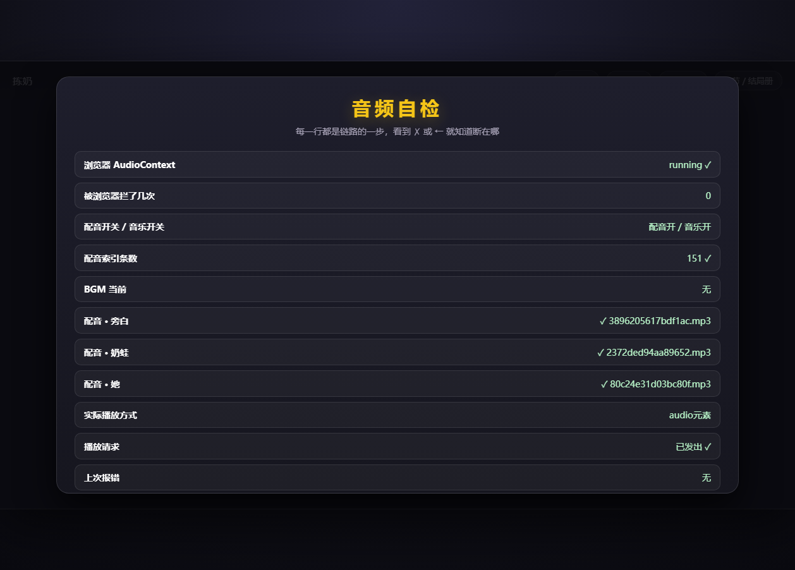

# 拣奶 · 奶蛙互动叙事

[](https://lwx-king.github.io/nai-wa/)

[](LICENSE)
[](LICENSES.md)


> 一个用**真奶蛙素材**做的浏览器互动叙事游戏。
> 玩法结构参考《拣爱》：**选项不重要，你在场景里做了什么才重要。**
>
> **▶ [点这里直接玩](https://lwx-king.github.io/nai-wa/)**（GitHub Pages，需要联网）
> 或者双击 `启动游戏.bat` 离线玩 —— 零安装、零依赖、不联网。

## 截图

| 第一章 · 奶茶店 | 第二章 · 八小时 |
|---|---|
|  |  |

| 第三章 · 客厅 | 音频自检 |
|---|---|
|  |  |

更多截图见 [`preview/`](preview/)。

---

## 一、怎么开始玩

**双击 `启动游戏.bat`** —— 会用默认浏览器打开游戏（推荐 Chrome / Edge）。

或者直接双击 `index.html` 也行。零安装、零依赖、不联网、不需要服务器。

- 1080P 以上的屏幕体验最好（游戏画面按 16:9 自适应缩放，手机浏览器也能玩）
- **点一下对白框 = 继续 / 立即显示全部文字**
- 有的地方不是点，是要**拖**（第二、三章会大量用到）
- 键盘 `D` 可以显示所有隐藏热点的位置（调试用，正式玩别按）

---

## 二、目前做了什么

**三章全部可玩：16 个场景、69 个互动热点、10 个结局、3 首 BGM、151 条配音。**

### 第一章《爱情╯奶茶》— 5 个结局

复刻《拣爱》第一章的玩法骨架：一整个场景里藏着"该做的事"，
只点选项就是钢铁直男，做对了才走好结局。

| 场景 | 你要做的事 |
|---|---|
| 奶茶店 | 别急着搭讪 —— **先看墙上那幅画**（她的头像是它）；顺手记住她喝什么 |
| 微信 | **先把 4 条朋友圈全点了**，再回她的话（不然你答不上来） |
| 点单 | 小游戏"喊单节奏"要点满 5 拍；然后点**对的那杯奶茶** |
| 电影院 | 两块海报，选她三刷过的《猫咪的一生》 |
| 火锅店 | 嘴上别浪 —— 递纸巾比想亲她有用 |
| 家里 | 她吵你的时候**什么都别说，去把那十九个奶茶杯收了** |
| 结局 | 点空地结算 |

**直男值**是这一章的核心数值：点错、抢拍、接话、想跑，都会 +1。
结局不看你怎么选，看这个数字和你在场景里真正做成了什么。

| 结局 | 条件 |
|---|---|
| 绝种好奶蛙 `HE` | 直男值 = 0 |
| 一般奶蛙 `BE` | 直男值 1–2 |
| 钢铁直蛙 `BE` | 直男值 ≥ 3 |
| 被拣走的奶蛙 `??` | 莽了一路（莽撞 + 抢拍 + 火锅想亲 ≥ 2 项），她居然还是喜欢你 |
| 奶茶杯收藏家 `??` | 把十九个杯子摆成心形收藏起来，不扔 |

### 第二章《爱情╯距离》— 3 个结局

异地恋 + 时差八小时。**这一章的时间会自己往前走。**

| 场景 | 玩法 |
|---|---|
| 站台（2008） | 在她过闸前，塞一样东西进她包里（奶茶 / 玩偶 / 只在玻璃上写个字） |
| 八小时 | 你的晚上八点 = 她的中午十二点。**点两边同时存在的东西**，凑成"同步"，凑满 3 次时间才会推进 |
| 年历 | 点桌上的**旧手机 / 收音机 / 笔电**＝翻年代（2008 / 2010 / 2012），三个年代各有细节 |
| 通宵电话 | 她手机只剩 3% 电。**千万别挂**（挂断是不可逆的失误），两边各点 3 个地方陪她走完 |
| 重逢（2012） | 出口，人潮。这次别写错。 |

| 结局 | 条件 |
|---|---|
| 很近，很远 `TE` | 同步满 3 次 + 陪她走完电话 + 没挂断 |
| 很远，很近 `HE` | 陪她走完电话 + 重逢时手里有东西 |
| 很远，记忆 `BE` | 挂断了那通只剩 3% 电量的电话 |

### 第三章《爱情╯侦探》— 2 个结局

一间屋子，三条线索，一个密码。

| 场景 | 线索 |
|---|---|
| 客厅 | 冰箱里那只**倒扣的盘子**背面有便利贴 → `584` |
| 卧室 | 床头柜上锁的盒子（**拖钥匙开锁**）里有张纸 → `201` |
| 阳台 | 洗衣机滚筒里（**把不是衣服的东西全掏出来**）有两张湿纸条 → `314` |
| 客厅 | 线索齐了，用三位**密码锁**开茶几上的铁盒子 |

| 结局 | 条件 |
|---|---|
| 结案 `TE` | 查完 → 抓起钥匙去机场，要一个"为什么" |
| 感谢游玩 `??` | 查完 → 把盒子摆正，像什么都没发生 |

### 音乐与配音

- **3 首 BGM**：第一章暖调俏皮、第二章怀旧疏离、第三章悬疑克制。
  全部是**程序合成**的（`tools/build-bgm.py`，不依赖任何素材库），进入章节自动切换
- **151 条配音**：全部台词逐句配音。台词本身是 `edge-tts` 合成的干声，
  再用 ffmpeg **`rubberband` 变声**调成奶蛙的音色：
  - 奶蛙：`pitch 1.75 / formant 1.02 / lowpass 2400`
  - 她：`pitch 1.14 / formant 1.10`（只提一点，保持女声自然）
  - 旁白：不处理，保持干净
- **笑声用真实素材**：整句就是一声笑的台词（`哈哈哈`、`哦齁齁齁。`）
  直接播真实奶蛙笑声，而不是让 TTS 去念"哈哈哈"三个字。
  注意判定是**严格**的 —— 像 `（别动。别说话。别哦齁齁齁。）` 这种带正经内容的句子
  照常念完整台词，不会被笑声吃掉
- 播配音时 BGM 自动压低到 30%
- 配音**默认用 `<audio>` 元素播放**（和 BGM 同一条路，兼容性最好），
  万一失败会自动回退到 WebAudio —— 两条路都留着，是因为有些机器上
  WebAudio 出不了声而 `<audio>` 正常（反过来也有）
- HUD 右上角有 `♪ 音乐` / `🎙 配音` 两个开关，状态记在 localStorage
- 没有配音的台词会安静显示文字，不会卡住

#### 变声参数是怎么定的（对着原声校）

参考音色取自 B站作品 **《奶蛙：一百分的家》**（UP 主 轩月27，
[第一集](https://www.bilibili.com/video/BV1U7bN6TEMc/) /
[第二集](https://www.bilibili.com/video/BV1RFYz6HELP/)）。

> 这些原声素材**没有随项目分发**（版权属于原 UP 主，已在 `.gitignore` 排除）。
> 想复现调参过程的话，自己下视频音频再跑下面的命令即可。

整集里混着 BGM 和旁白，所以先自动抠出"奶蛙音区"的片段：

```bash
# 从整集里挑出基频 240–800Hz、响度够的段，拼成一份参考
python tools/extract-voice-ref.py ep2.mp3 ref_ep2.wav 240 800
```

抠出来的参考指纹是：

| 指标 | 奶蛙原声 | 校准后成品 |
|---|---|---|
| 基频 f0 | 374 Hz | 371 Hz |
| 谱质心（亮度） | 1449 Hz | 1518 Hz |
| 85% 滚降 | 2422 Hz | 2498 Hz |
| 谱包络相关 | — | 0.845 |

然后用 `tools/iterate-voice.py` **按比值迭代校正**（量一次 → 按误差乘系数 → 再量）：

```bash
python tools/iterate-voice.py raw.mp3 ref_ep2.wav
```

> ⚠️ 这里有个反直觉的点：奶蛙的音色**比通用 TTS 还暗**（质心 1449 vs 1744）。
> 所以正确做法是**低通压暗**，不是加提亮。之前几版一直往"更尖更亮"调，方向就是错的。

`tools/voiceprint.py` 可以单独看任意音频的音色特征：

```bash
python tools/voiceprint.py 音频A.mp3 音频B.mp3     # 两两比较会输出比值
```

#### 没声音？点 HUD 上的「🔍 自检」

浏览器有一条硬规定：**必须先有真实的点击或按键，才允许网页出声**。
所以请**先在画面上点一下**，再点自检。自检会把整条链路一行一行摊开：

| 行 | 看到什么算正常 |
|---|---|
| 浏览器 AudioContext | `running ✓` ← 这行不是 running 就是还没解锁，点一下画面再来自检 |
| 配音索引条数 | `151 ✓` ← 不是 151 说明 `js/voice-manifest.js` 没加载 |
| 配音 · 旁白 / 奶蛙 / 她 | 各有一个 `✓ 文件名` ← 是 ✗ 说明 `audio/voice/` 目录缺了 |
| 实际播放方式 | `audio元素` 或 `WebAudio` ← 走通了哪条路 |
| 播放请求 | `已发出 ✓` |
| 上次报错 | `无` ← 有内容就把这行发我 |

也可以在地址栏加 `?audio`（即 `index.html?audio`）直接进自检页。

> 只听到 BGM、听不到人声：说明 `<audio>` 那条路通、WebAudio 那条路不通。
> 最新版已经把人声也切到 `<audio>` 了；自检里「实际播放方式」应该显示 `audio元素`。

---

## 三、文件结构

```
拣奶/
├─ 启动游戏.bat        双击开玩
├─ index.html          页面骨架（不含业务逻辑）
├─ style.css           全部样式
├─ LICENSES.md         奶蛙贴图的来源与 CC BY 4.0 署名
├─ audio/
│  ├─ bgm/             3 首循环 BGM（程序合成）
│  └─ voice/           151 条配音（edge-tts 生成）
├─ tools/
│  ├─ build-sprites.py 从 spritesheet.webp 重新生成奶蛙贴图数据
│  ├─ build-bgm.py     重新合成 3 首 BGM
│  └─ build-voice.py   重新生成全部配音（增量，改台词只补新的）
└─ js/
   ├─ sprites.js       ★ 内联的奶蛙贴图数据（自动生成，别手改）
   ├─ voice-manifest.js★ 配音索引：文本 hash -> 音频文件（自动生成，别手改）
   ├─ art.js           ★ 美术层：奶蛙贴图的缩放/翻转/配色，道具与背景（SVG）
   ├─ audio.js         ★ 音乐与配音播放（含 BGM 自动压低）
   ├─ engine.js        ★ 引擎：状态机、场景渲染、热点命中、对白、小游戏、
   │                     结局判定、存档、可达性校验
   ├─ chapter-kit.js   三章共用的脚手架（切场景 / 换表情 / 记失误）
   ├─ chapter1.js      第一章：奶茶店 → 微信 → 点单 → 电影 → 火锅 → 家里
   ├─ chapter2.js      第二章：站台 → 八小时 → 年历 → 通宵电话 → 重逢
   ├─ chapter3.js      第三章：客厅 → 卧室 → 阳台 → 密码锁 → 结案
   └─ selfcheck.js     自检脚本（node js/selfcheck.js）
```

场景、道具、背景是代码画出来的 SVG；奶蛙本体是真实贴图；
音乐是程序合成的；配音是 TTS 生成的。**没有一处依赖外部素材包**。

---

## 四、奶蛙素材是怎么来的（重要）

游戏里的奶蛙**不是手画的**，是真实的奶蛙素材：

| | |
|---|---|
| 来源 | [Maple498/nai-wa-codex-pet](https://github.com/Maple498/nai-wa-codex-pet) 的 `spritesheet.webp` |
| 许可 | **CC BY 4.0** —— 维持署名即可自由使用、修改、商用 |
| 内容 | 11 组动作 × 最多 8 帧，共 74 帧：待机 / 左右跑 / 挥手 / 大笑 / 震惊 / 破防大哭 / 躺平 / 鞠躬 / 低头 |

处理流程：`spritesheet.webp` → ffmpeg 解成 RGBA → 按 8×11 网格切帧并裁掉透明边 →
128 色调色板量化 → 内联成 data URI 写进 `js/sprites.js`（271KB）。
这套流程固化在 `tools/build-sprites.py` 里，想换素材或加动作直接跑它：

```bash
python tools/build-sprites.py <你的 spritesheet.webp>
```

**为什么内联**：`file://` 直接双击打开时，SVG / Canvas 读本地图片会被浏览器的
跨域策略挡掉。内联成 data URI 就完全没这个问题，代价只是 js 文件大一点。

署名（按 CC BY 4.0 要求保留，完整版见 `LICENSES.md`）：

> "奶蛙 Codex Pet" 像素动画，来源于 [nai-wa-codex-pet](https://github.com/Maple498/nai-wa-codex-pet)，采用 CC BY 4.0 授权；本项目对其做了切帧、调色板量化与内联打包。

另外声明：奶蛙的**网络流行形象原型**不属于上述仓库所能确认或授予的权利范围，
该仓库仅就维护者实际创作的像素重绘与动画编排授权。

### 角色配色

- **你**（黄奶蛙）＝ 原始贴图
- **她**（粉奶蛙）＝ 同一套贴图 + CSS `hue-rotate` 滤镜（`art.js` 里的 `LOOKS`）

---

## 五、动作 / 表情系统（怎么让奶蛙演起来）

角色定义只需要一个 `action`：

```js
chars: [
  { id: 'me',  x: 400, y: 650, scale: 1.0,  action: 'idle' },
  { id: 'her', x: 990, y: 662, scale: 0.96, action: 'idle', look: 'pink', flip: true }
]
```

- `x, y` 是**脚底中心**（不是图片中心），贴图会按 `y` 往上摆
- `action`：`idle` `idle2` `walk` `walkL` `wave` `laugh` `shock` `cry` `lie` `bow` `shake`
- `frame`：取第几帧（不给就取第 0 帧）
- `look`：`pink` / `blue` / `gray`
- `flip`：左右翻转

对白进行中还能**当场换表情**：

```js
{ who: '奶蛙（她）', text: '……你以前怎么不这样。', then: function () { face('her', 'cry', 1); } }
```

`face(角色id, 动作, 帧)` 只重画那一格，不重载场景，所以表情是"跟着台词走"的。
第一章里已经在 9 个关键节拍上埋了表情切换（她破防、她哭、他震惊、她大笑……）。

---

## 六、怎么加内容（改哪个文件）


### 改一句话

打开 `js/chapter1.js`，找到那段对白数组，直接改 `text` 字段。刷新浏览器即可。

对白格式：

```js
{ who: '奶蛙', text: '台词' }                  // 奶蛙说
{ who: '奶蛙（她）', text: '台词' }             // 她说
{ who: '', style: 'nar', text: '旁白' }         // 旁白
{ who: '奶蛙', text: '台词', then: function () { F.xxx = true; } }  // 显示后触发的逻辑
```

### 加一个可点的地方

在场景的 `hotspots` 里加：

```js
{
  id: 'uniqueId',          // 必须唯一
  x: 640, y: 400, r: 80,   // 圆形范围（也可以用 w/h 做矩形）
  fx: 'shine',             // 点中特效：shine / pop / heart
  if: function (f) { return f.someFlag; },   // 满足条件才出现（可选）
  beats: [ /* 对白数组 */ ]                  // 点中后播的对白
}
```

### 切场景

```js
then: function () { draw(scenes.nextSceneId); }   // draw = drawScene + 播放该场景 enter()
```

> ⚠️ 场景切换**一定要用 `draw()`**，它会先切场景再排对白。
> 只调 `E.drawScene()` 不排对白，或顺序写反，会让新场景的对白被旧队列冲掉。

### 加一个结局

1. 在 `window.CHAPTERS.ch1.endings` 里加一条 `{id, name, rank, desc}`
2. 在 `judgeEnding()` 里加一条判定
3. 在场景里 `E.finish('你的id')` 触发

---

## 七、奶蛙是什么（创作背景）

奶蛙不是任何官方角色。它是网友用 AI 以"奶龙"为原型生成的二创生物：
黄色、圆滚滚、青蛙眼、咧嘴大笑，配"哦齁齁齁"的雷霆笑声。
后来和牛来、美团肥嘟嘟袋鼠一起被网友凑成「黄色三幻神」。

B 站上已经有 UP 主扎克鸡做的《旅行奶蛙》（模仿旅行青蛙）、
《奶蛙跑酷》等二创。**本项目走的是另一条路：把奶蛙塞进《拣爱》的叙事交互结构里。**

### 关于你电脑上那份《拣爱》

路径 `C:\Users\LWX\jianai\jianai\LoveChoice.exe`（Unity 5.6 / Mono，2017.4 构建）。
我确认过：**那个包里只有原版《拣爱》自己的美术，没有任何奶蛙素材**
（它是原版游戏的转载包，`游戏启动说明.txt` 里写着"抖音：阿木的游戏"打包、
公众号"阿呆的软件"分发）。

所以本项目：
- **玩法结构**参考《拣爱》——场景热点、拖拽、小游戏、多结局，这是玩法不受版权保护的部分
- **奶蛙本体**用的是上面说的 CC BY 4.0 真实素材
- **没有从那份盗版包里扒任何资源**（顺带说，如果想接着做，建议买正版）

---

## 八、开发与自检

```bash
# 语法检查
node --check js/chapter1.js

# 逻辑自检（结局判定 + 对白队列推进协议）
node js/selfcheck.js

# 重新生成素材（可选）
python tools/build-sprites.py <spritesheet.webp>   # 奶蛙贴图
python tools/build-bgm.py                          # 三首 BGM
python tools/build-voice.py                        # 全部配音（增量）
```

`selfcheck.js` 重点守住两个以前踩过的坑：

1. **`then` 回调不能重复触发** —— 打字机定时器和点击可能同时推进同一拍，
   触发两次会把新排入的对白整批冲掉（症状：场景卡住、对白不出现）。
2. **`owned` 结局的优先级** —— 必须先于 `simp` 判定。

### 热点可达性校验（这个很有用）

第二、三章场景一多，很容易出现"**A 热点的半径盖住了 B 热点的命中点**"，
症状是玩家点了 B 却触发了 A（或者干脆没反应）。

引擎里内置了一个检查器 —— 把画面按网格铺开、像素级判断每个热点
"有没有一块可点区域是只属于它的"，再用洪水填充看这块区域有没有被切碎：

```js
// 浏览器控制台（先把三章都打开过一次）
GAME.dev.audit()
// 返回 [] 就是全通过；否则会指出哪个场景的哪个热点被谁挡住

// 查单次点击到底命中了什么
GAME.dev.probe(640, 200)
```

另外还有一个**输入冷却**：对白刚结束的 140ms 内忽略场景点击。
不然手快的玩家点完最后一句会立刻点场景，那一下会被"推进对白"吃掉，
表现为"我明明点了那个东西却没反应"。

---

## 九、已知简化 / 待办

- 没有转场动画，场景是硬切
- 存档只存结局收集进度，不存档中途进度
- 配音是 TTS 合成的，奶蛙那种"变声器笑声"只能算贴近，不是原声
- 音效（点击、开门、洗衣机）还没做，只有 BGM + 配音
- 热点命中是圆形/矩形手写判定，不是像素级（故意留的，方便改）
- 第二章"同步"的三个瞬间里，`lampL` / `rugR` 稍显抽象，可以再补视觉反馈
